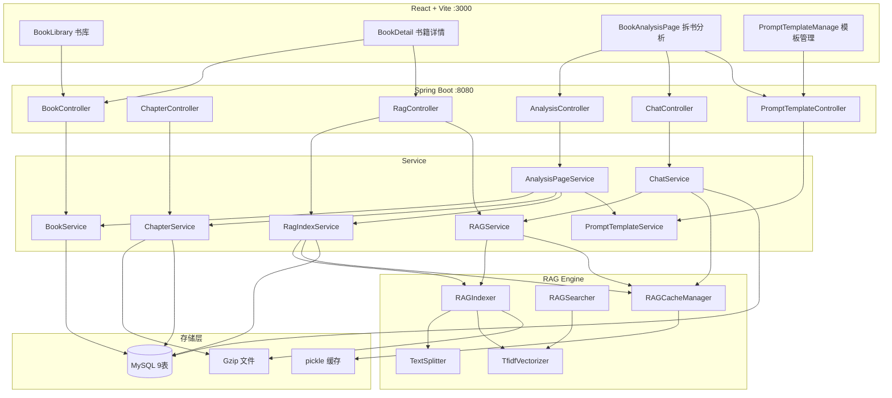
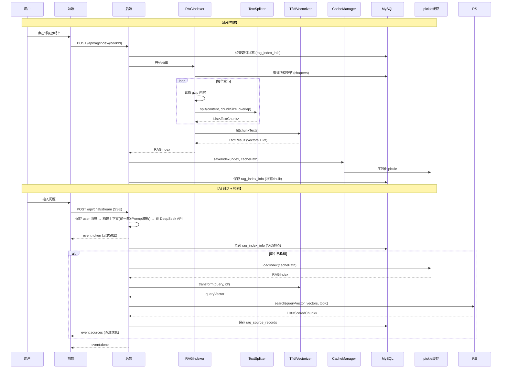

# 小说AI拆书分析工具 — 项目结构与接口文档

## 一、项目概览

| 项目 | 描述 |
|------|------|
| **定位** | 面向小说读者、网文创作者、内容研究者的 Web 应用 |
| **核心能力** | AI 结构化拆书 + 基于 RAG 的书籍深度 AI 问答分析 |
| **技术栈** | Spring Boot 3.3.8 + JPA + MySQL 8 (后端) / React 18 + Vite 5 + TypeScript + Ant Design (前端) |
| **数据架构** | MySQL (结构化元数据) + Gzip 冷存储 (章节正文) + pickle 序列化 (RAG 索引缓存) |
| **数据目录** | `/Users/qianxuyang/PycharmProjects/pythonProject1/data` |
| **RAG 算法** | TF-IDF + 余弦相似度 (中文二元分词) |

---

## 二、系统架构图



---

## 三、后端模块详解

### 3.1 数据实体 (Entity) — 共 9 表

| 表名 | 实体类 | 主键 | 说明 |
|------|--------|------|------|
| `books` | `Book` | `book_id` (String) | 书籍主表，含书ID、标题、作者、分类、来源、封面等 |
| `chapters` | `Chapter` | `id` (Long) 自增 | 章节元数据表，唯一约束 `(book_id, chapter_index)`，含 gzip 内容路径 |
| `chat_history` | `ChatHistory` | `id` (Long) 自增 | AI 对话历史，book_id 隔离，含 role/user/assistant |
| `prompt_templates` | `PromptTemplate` | `id` (Integer) 自增 | Prompt 模板，支持 isQuickBtn/isSystem 标记 |
| `rag_index_info` | `RagIndexInfo` | `book_id` (String) | RAG 索引元数据，含分块参数、状态、缓存路径 |
| `rag_source_records` | `RagSourceRecord` | `id` (Long) 自增 | AI 回答的溯源记录，关联 chat_message_id |
| `crawl_tasks` | `CrawlTask` | `id` (Long) 自增 | 爬取任务队列 |
| `rank_books` | `RankBook` | `id` (Integer) 自增 | 排行榜书籍，唯一约束 `(source, book_id)` |
| `scheduler_config` | `SchedulerConfig` | `id` (Integer) 自增 | 定时调度配置 |

### 3.2 Repository 层 (JPA)

| 接口 | 继承 | 自定义方法 |
|------|------|-----------|
| `BookRepository` | `JpaRepository<Book, String>`, `JpaSpecificationExecutor<Book>` | `findAllByOrderByCreatedAtDesc()` |
| `ChapterRepository` | `JpaRepository<Chapter, Long>` | `findByBookIdOrderByChapterIndexAsc`, `findByBookIdAndChapterIndexBetween`, `countByBookId` |
| `ChatHistoryRepository` | `JpaRepository<ChatHistory, Long>` | `findByBookIdOrderByCreateTimeAsc`, `deleteByBookId` |
| `PromptTemplateRepository` | `JpaRepository<PromptTemplate, Integer>` | `findAllByOrderBySortOrderAsc`, `findByIsQuickBtnAndEnabledOrderBySortOrderAsc`, `existsByIsSystemTrueAndId` |
| `RagIndexInfoRepository` | `JpaRepository<RagIndexInfo, String>` | `findByBookId` |
| `RagSourceRecordRepository` | `JpaRepository<RagSourceRecord, Long>` | `findByChatMessageIdOrderByRankAsc`, `deleteByBookId` |
| `CrawlTaskRepository` | `JpaRepository<CrawlTask, Long>` | — |
| `RankBookRepository` | `JpaRepository<RankBook, Integer>` | — |
| `SchedulerConfigRepository` | `JpaRepository<SchedulerConfig, Integer>` | — |

### 3.3 Service 层 — 共 7 个

| Service | 职责 | 关键方法 |
|---------|------|---------|
| **BookService** | 书籍 CRUD + 搜索筛选 | `findAll()`, `findById()`, `search(category, source, keyword, page, size)`, `getAllCategories()`, `getAllSources()`, `deleteById()` |
| **ChapterService** | 章节读取 | `findByBookId()`, `findChaptersByRange(bookId, start, end)`, `readChapterContent(Chapter)`, `countByBookId()` |
| **ChatService** | SSE 流式 AI 对话 | `streamChat(ChatRequestDTO)` → SseEmitter (3min 超时), `getHistory(bookId)`, `clearHistory(bookId)`。对话流程：保存 user 消息 → 构建上下文(含前十章+Prompt模板) → 调用 DeepSeek API (SSE) → 保存 assistant 消息 → RAG 检索溯源 → 发送 sources 事件 |
| **AnalysisPageService** | 拆书分析页数据聚合 | `getAnalysisPage(bookId)` 聚合书籍信息+前十章+RAG状态+快捷Prompt |
| **PromptTemplateService** | Prompt 模板 CRUD | `findAll()`, `create()`, `update()`, `delete()`, `toggleEnabled()`, `importTemplates()`, `findQuickButtons()` |
| **RagIndexService** | RAG 索引管理 | `getStatus(bookId)`, `buildIndex()`, `rebuildIndex()`, `clearIndex()`, `clearAllCache()`, `getConfig()`, `updateConfig()` |
| **RAGService** | RAG 检索与上下文 | `searchWithSources(bookId, query)`, `getTenChapterContext(bookId)`, `getAllBuiltStatus()` |

### 3.4 RAG 引擎层 (com.webbook.rag)

| 组件 | 职责 |
|------|------|
| **TextSplitter** | 文本分块，滑动窗口 `chunkSize`/`overlap` 参数可配置 |
| **TfidfVectorizer** | TF-IDF 向量化，中文二元分词 (bigram + unigram) |
| **RAGIndex** | 索引数据结构 (Serializable)，含 `chunkTexts`/`vectors`/`idf`/`chapterIndices`/`chapterTitles` |
| **RAGIndexer** | 索引构建：读取章节 → 分块 → 向量化 → 保存 pickle |
| **RAGSearcher** | 余弦相似度 Top-K 检索 |
| **RAGCacheManager** | pickle 文件持久化 (save/load/delete) |

### 3.5 Controller 层 & API 接口

#### 书籍模块 `GET /api/books`

```
GET    /api/books?category=&source=&keyword=&page=&size=
        → 无参数: Book[] | 有参数: {content, totalElements, totalPages, number, size}
GET    /api/books/categories  → string[]
GET    /api/books/sources     → string[]
GET    /api/books/{bookId}    → Book
GET    /api/books/{bookId}/chapters → Chapter[]
DELETE /api/books/{bookId}    → 200 (同时清理 RAG 缓存)
GET    /api/books/{bookId}/analysis-page → AnalysisPageDTO
```

#### 章节模块 `GET /api/chapters`

```
GET /api/chapters/{id}/content → {bookId, chapterIndex, chapterTitle, content}
```

#### AI 对话 `POST /api/chat`

```
POST   /api/chat/stream  → SSE (text/event-stream)
        Body: {bookId, message, promptTemplateId?, tenChapterContext?}
        Events: token | sources | done | error

GET    /api/chat/history/{bookId}  → ChatHistory[]
DELETE /api/chat/history/{bookId}  → 200
```

#### Prompt 模板 `GET /api/prompts`

```
GET    /api/prompts             → PromptTemplate[]
GET    /api/prompts/{id}        → PromptTemplate
GET    /api/prompts/quick-buttons → PromptTemplate[]
POST   /api/prompts             → PromptTemplate
PUT    /api/prompts/{id}        → PromptTemplate
DELETE /api/prompts/{id}        → 200
PUT    /api/prompts/{id}/toggle → PromptTemplate
GET    /api/prompts/export/{id}  → PromptTemplate
GET    /api/prompts/export      → PromptTemplate[]
POST   /api/prompts/import      → 200
POST   /api/prompts/init-defaults → 200 (初始化4个系统模板)
```

#### RAG 管理 `POST /api/rag`

```
GET    /api/rag/status/{bookId}      → RagStatusDTO
GET    /api/rag/status               → RagStatusDTO[] (全部)
POST   /api/rag/index/{bookId}       → RagStatusDTO (构建, Body可选RagConfigDTO)
PUT    /api/rag/reindex/{bookId}     → RagStatusDTO (重建)
DELETE /api/rag/index/{bookId}       → 200
GET    /api/rag/config/{bookId}      → RagConfigDTO
PUT    /api/rag/config/{bookId}      → 200
DELETE /api/rag/cache/global         → 200
POST   /api/rag/search/{bookId}      → SourceRecordDTO[] (测试用, Body: {query})
```

### 3.6 DTO 数据模型

| DTO | 字段 |
|-----|------|
| **AnalysisPageDTO** | `book` (BookDTO), `chapters` (ChapterDTO[]), `ragStatus` (RagStatusDTO), `quickPrompts` (PromptTemplateDTO[]) |
| **ChatRequestDTO** | `bookId`, `message`, `promptTemplateId?`, `tenChapterContext?` |
| **RagStatusDTO** | `bookId`, `status` (not_built/built/rebuilding), `chunkSize`, `overlap`, `topK`, `shortBookFullText`, `chunkCount`, `wordCount`, `builtAt` |
| **RagConfigDTO** | `chunkSize`, `overlap`, `topK`, `shortBookFullText` |
| **SourceRecordDTO** | `chapterIndex`, `chapterTitle`, `excerpt`, `rank` |
| **PromptTemplateDTO** | `id`, `name`, `description`, `scene`, `content`, `isQuickBtn`, `isSystem`, `enabled`, `sortOrder`, `createdAt`, `updatedAt` |

---

## 四、前端模块详解

### 4.1 路由结构

| 路径 | 页面组件 | 说明 |
|------|---------|------|
| `/` | `BookLibrary` | 书库首页，搜索/筛选/分页 |
| `/books/:bookId` | `BookDetail` | 书籍详情 + RAG 管理面板 |
| `/books/:bookId/analysis` | `BookAnalysisPage` | 拆书分析 (核心页面) |
| `/admin/prompts` | `PromptTemplateManage` | Prompt 模板管理后台 |

### 4.2 页面详解

#### BookLibrary (书库首页)
- **功能**：分类下拉、来源下拉、关键词搜索、查询/重置按钮、分页
- **组件**：`BookCard` (封面+标题+作者+来源+删除按钮)
- **数据流**：`searchBooks(params)` → 无参数返回 `Book[]`，有参数返回 `BookSearchResult`

#### BookDetail (书籍详情页)
- **功能**：展示书籍信息 + RAG 状态面板 + 操作栏 + 配置表单
- **组件**：`RagStatusPanel`, `RagOperationBar`, `RagConfigForm`
- **入口**：「进入AI拆书」按钮 → `/books/:bookId/analysis`

#### BookAnalysisPage (拆书分析页 — 核心)
- **布局**：左侧章节内容区 + 右侧 AI 对话区
- **功能区**：
  - `BookInfoSection` — 书籍信息区 (封面、标题、作者、来源、简介)
  - `ChapterContentSection` — 前十章正文区 (可滚动)
  - `PromptToolbar` — Prompt 快捷按钮区 (动态渲染)
  - `ChatSection` — AI 对话交互区 (SSE 流式)
  - `PromptManageModal` — 内嵌 Prompt 管理弹窗
  - 所有 AI 对话默认携带前十章内容作为固定上下文

#### PromptTemplateManage (模板管理后台)
- **功能**：表格展示、新增/编辑/删除/启禁、批量导入/导出 JSON

### 4.3 API 封装层 (frontend/src/api/)

| 文件 | 端点前缀 | 导出函数 |
|------|---------|---------|
| `books.ts` | `/api/books` | `fetchBooks`, `fetchBook`, `fetchChapters`, `searchBooks`, `fetchCategories`, `fetchSources`, `deleteBook` |
| `analysis.ts` | `/api/books` | `fetchAnalysisPage` |
| `chat.ts` | `/api/chat` | `streamChat` (SSE, fetch/ReadableStream), `fetchChatHistory`, `clearChatHistory` |
| `prompts.ts` | `/api/prompts` | `fetchPrompts`, `fetchPrompt`, `fetchQuickButtons`, `createPrompt`, `updatePrompt`, `deletePrompt`, `togglePrompt`, `exportPrompt`, `exportAllPrompts`, `importPrompts` |
| `rag.ts` | `/api/rag` | `fetchRagStatus`, `buildRagIndex`, `rebuildRagIndex`, `clearRagIndex`, `fetchRagConfig`, `updateRagConfig`, `clearGlobalRagCache`, `searchRag` |

### 4.4 Context 状态管理

**ChatContext** (`ChatContext.tsx`) — 管理当前书籍的 AI 对话状态：

- `messages: ChatHistory[]` — 对话消息列表，支持追加 token
- `sources: Record<number, SourceRecord[]>` — 每条助手消息的溯源记录
- `isStreaming: boolean` — 流式响应状态锁
- `updateLastMessage(token)` — 追加模式更新最后一条消息 (非替换)

### 4.5 类型定义 (types/index.ts)

| 类型 | 关键字段 |
|------|---------|
| `Book` | bookId, title, author, category, source, chapterCount, totalChapters, coverUrl, crawlStatus |
| `Chapter` | id, bookId, chapterIndex, chapterTitle, contentPath, contentSize |
| `ChatHistory` | id, bookId, role, content, source, createTime |
| `RagStatus` | bookId, status, chunkSize, overlap, topK, chunkCount, wordCount, builtAt |
| `RagConfig` | chunkSize, overlap, topK, shortBookFullText |
| `PromptTemplate` | id, name, description, scene, content, isQuickBtn, isSystem, enabled, sortOrder |
| `AnalysisPageData` | book, chapters[], ragStatus, quickPrompts[] |
| `SSEEvent` | type ('token'|'sources'|'done'|'error'), data |

---

## 五、RAG 全链路流程



---

## 六、配置与环境

### 6.1 后端配置 (application.yml)

```yaml
server.port: 8080
spring.datasource:
  url: jdbc:mysql://localhost:3306/book_analyzer
  username: root
  password: 12345678
deepseek:
  api-key: ${DEEPSEEK_API_KEY}
  api-url: https://api.deepseek.com/chat/completions
  model: deepseek-chat
  temperature: 0.7
  max-tokens: 4096
app:
  data-dir: /Users/qianxuyang/PycharmProjects/pythonProject1/data
  chapter-dir: ${app.data-dir}/books
  rag-cache-dir: ${app.data-dir}/rag_cache
```

### 6.2 环境变量

```bash
# ~/.zshrc
export DEEPSEEK_API_KEY=your_api_key_here
```

### 6.3 启动方式

```bash
# 后端
cd backend
mvn spring-boot:run

# 前端
cd frontend
npm install  # 首次
npm run dev  # → http://localhost:3000
```

---

## 七、业务模块与功能清单

| 业务模块 | 前端页面 | 后端 Controller | 功能点 |
|---------|---------|----------------|--------|
| **书库管理** | BookLibrary | BookController | 书籍列表展示、分类/来源/关键词筛选、分页、删除书籍(含RAG清理)、单击卡片进入详情 |
| **书籍详情** | BookDetail | BookController + RagController | 书籍信息展示、RAG 状态查看、索引构建/重建/清空、RAG 参数热配置 |
| **AI 拆书分析** | BookAnalysisPage | AnalysisController + ChatController + PromptController | 书籍信息区、前十章正文预览、Prompt 快捷按钮、AI 对话交互(SSE)、RAG 溯源展示 |
| **Prompt 模板管理** | PromptTemplateManage | PromptTemplateController | 模板 CRUD、系统模板保护、启用/禁用、批量导入/导出 JSON、4 个系统默认模板(剧情结构/人物关系/人设/爽点节奏) |
| **RAG 管理** | 嵌入 BookDetail | RagController | 索引构建/重建/清空、状态展示、参数配置(chunkSize/overlap/topK)、全局缓存清理 |
| **爬虫任务** | 无前端 | (引擎层) | `crawl_tasks` 任务表、`rank_books` 排行榜表、`scheduler_config` 调度配置表 |

---

## 八、Changelog

| 日期 | 变更 |
|------|------|
| 2026-06-24 | 首次生成项目结构与接口文档 |
